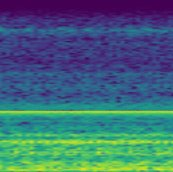
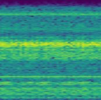
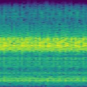
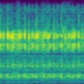

# Motor Preserve - 베어링 결함 실시간 진단 시스템

> ResNet18 기반 베어링 진동 데이터 분석 및 결함 부위 자동 분류 시스템

---

## 프로젝트 개요

베어링의 진동 데이터를 스펙트로그램 이미지로 변환하여
AI 모델이 결함 부위를 실시간으로 분류하는 시스템입니다.

| 항목 | 내용 |
|------|------|
| 기간 | 2026. 04. 06 ~ 04. 11 (6일) |
| 모델 | ResNet18 (전이 학습) |
| 데이터셋 | CWRU Bearing Dataset + IMS Bearing Dataset |
| 분류 클래스 | normal / ball / inner_race / outer_race |
| 최종 정확도 | 약 84% |

---

## 시스템 아키텍처

```
[로컬 클라이언트]
  진동 데이터 or 스펙트로그램 PNG
        │ TCP 9000
        ▼
[추론 서버 (Python)]
  스펙트로그램 변환 (RAW 방식) 또는 이미지 직접 수신
  ResNet18 추론
  결함 판정 결과 출력 + 스펙트로그램 저장
```

---

## 동작 흐름

```
1단계. 데이터 탐색 (data.py)
       IMS 진동 데이터의 RMS 추이를 그래프로 시각화
       → 이상 발생 시점 파악

          ↓

2단계. 스펙트로그램 생성 (spectrogram_CWRU.py / spectrogram_ISM.py)
       원본 .mat / .csv 파일을 STFT 변환하여 PNG 이미지로 저장
       → ./spectrogram_for_learning/ 에 train / val / test 분류 저장

          ↓

3단계. 모델 학습 (learning.py)
       ResNet18 전이 학습, 클래스 불균형 대응 가중치 적용, Early Stopping
       → bearing_model.pth 저장

          ↓

4단계. 모델 테스트 (learning_test.py)
       test 이미지로 전체 정확도 및 클래스별 세부 정확도 측정

          ↓

5단계. 실시간 서버 운용 (두 가지 방식)

  [방식 A - 이미지 전송]       [방식 B - RAW 데이터 전송]
  local_image.py               local_real.py
       │ PNG 전송                    │ 진동 숫자 데이터 전송
       ▼                            ▼
  server_image.py              server_real.py
  이미지 수신 → 추론            수신 → 스펙트로그램 변환 → 추론
```

---

## 프로젝트 구조

```
motor-preserve/
│
├── data.py                  # 1단계 : 데이터 탐색 및 시각화
│
├── spectrogram_CWRU.py      # 2단계 : CWRU 데이터셋 스펙트로그램 생성
├── spectrogram_ISM.py       # 2단계 : IMS 데이터셋 스펙트로그램 생성
│
├── learning.py              # 3단계 : 모델 학습
├── learning_test.py         # 4단계 : 모델 성능 테스트
│
├── local_image.py           # 5단계 : 이미지 전송 클라이언트
├── server_image.py          # 5단계 : 이미지 수신 서버
│
├── local_real.py            # 5단계 : RAW 데이터 전송 클라이언트
├── server_real.py           # 5단계 : RAW 데이터 수신 서버
│
├── requirements.txt
└── README.md
```

---

## 스펙트로그램 예시

진동 데이터를 STFT(Short-Time Fourier Transform)로 변환한 이미지입니다.
결함 종류에 따라 주파수 패턴이 시각적으로 다르게 나타납니다.

| normal | ball | inner_race | outer_race |
|--------|------|------------|------------|
|  |  |  |  |

---

## 사용 데이터셋

| 항목 | CWRU | IMS |
|------|------|-----|
| 출처 | Case Western Reserve University | NASA IMS |
| 데이터 폴더 | `./cwru/` | `./ism/` |
| 파일 형식 | .mat | .csv |
| 샘플링 주파수 | 12,000 Hz | 20,000 Hz |
| 결함 클래스 | normal / ball / inner_race / outer_race | normal / ball / inner_race |
| 데이터 추출 | Drive End(DE) 채널 | Bearing 1~4 채널 |
| 전처리 | 리샘플링 없음 | 12,000 Hz로 다운샘플링 |

두 데이터셋은 파일 형식과 채널 구성이 달라 각각 별도의 전처리 스크립트로 처리됩니다.

---

## 전처리 파이프라인

```
원본 데이터 (.mat / .csv)
        │
        ▼
  채널 선택 (결함 종류별 베어링 채널 지정)
        │
        ▼
  리샘플링 (IMS만 해당: 20,000 Hz → 12,000 Hz)
        │
        ▼
  슬라이딩 윈도우 분할 (Window: 10,240 샘플)
  - 정상 데이터 : Step 1,024 (겹침 없음)
  - 결함 데이터 : Step 256 (75% 겹침, 데이터 증강)
        │
        ▼
  STFT 변환 → 스펙트로그램 이미지 (224×224 px)
        │
        ▼
  train / val / test 분할 (8 : 1 : 1)
```

---

## AI 모델 성능

| 항목 | 내용 |
|------|------|
| 모델 | ResNet18 (ImageNet 사전학습 가중치 적용) |
| 학습 데이터 | CWRU + IMS 통합 |
| Epochs | 최대 50 (Early Stopping 적용, patience=7) |
| 최종 정확도 | **약 84%** |

### 클래스 불균형 대응

데이터셋 특성상 normal 클래스 데이터가 결함 클래스보다 적어,
손실 함수에 클래스별 가중치를 적용하여 보정했습니다.

| 클래스 | ball | inner_race | normal | outer_race |
|--------|------|------------|--------|------------|
| 가중치 | 1.0 | 1.0 | 3.5 | 2.1 |

---

## 통신 프로토콜

클라이언트는 헤더와 데이터 바디를 하나의 TCP 패킷으로 전송합니다.
헤더는 콜론(`:`)으로 구분된 문자열이며, 개행(`\n`)을 기준으로 바디와 구분됩니다.

### 방식 A — 이미지 전송 (local_image ↔ server_image)

```
헤더: IMG_S:{파일명}:{정답 클래스}\n
바디: PNG 이미지 바이트

예시: IMG_S:B021_1.mat_60.png:ball\n + [이미지 바이트]
```

| 필드 | 설명 |
|------|------|
| `IMG_S` | 데이터 타입 식별자 (이미지 전송) |
| 파일명 | 원본 스펙트로그램 파일명 |
| 정답 클래스 | normal / ball / inner_race / outer_race |

서버는 PNG를 그대로 수신하여 AI 추론을 수행합니다.

### 방식 B — RAW 데이터 전송 (local_real ↔ server_real)

```
헤더: RAW_S:{파일명}:{번호}:{정답 클래스}:{데이터셋 출처}:{샘플링 주파수}\n
바디: float64 진동 데이터 바이트

예시: RAW_S:IR014_2.mat:1:inner_race:CWRU:12000\n + [진동 데이터 바이트]
```

| 필드 | 설명 |
|------|------|
| `RAW_S` | 데이터 타입 식별자 (RAW 진동 데이터 전송) |
| 파일명 | 원본 데이터 파일명 |
| 번호 | 베어링 번호 |
| 정답 클래스 | normal / ball / inner_race / outer_race |
| 데이터셋 출처 | CWRU 또는 ISM |
| 샘플링 주파수 | 원본 데이터의 샘플링 주파수 (Hz) |

서버는 수신한 진동 데이터를 직접 스펙트로그램으로 변환한 뒤 AI 추론을 수행합니다.
샘플링 주파수가 12,000 Hz가 아닌 경우 자동으로 리샘플링합니다.

### 방식 A / B 비교

| 항목 | 방식 A (이미지 전송) | 방식 B (RAW 전송) |
|------|---------------------|------------------|
| 전송 데이터 | PNG 이미지 | float64 진동 숫자 배열 |
| 스펙트로그램 변환 위치 | 클라이언트 (사전 생성) | 서버 (실시간 변환) |
| 실제 센서 환경과의 유사도 | 낮음 | **높음** |
| 서버 처리 부하 | 낮음 (추론만) | 높음 (변환 + 추론) |
| 사전 준비 필요 | 스펙트로그램 PNG 필요 | 원본 데이터 파일만 있으면 됨 |

---

## 실행 방법

### 사전 준비

| 스크립트 | 필요한 데이터 폴더 |
|----------|-------------------|
| `data.py` | `./pre_test/` — IMS 원본 데이터 |
| `spectrogram_CWRU.py` | `./cwru/` — CWRU 원본 .mat 파일 |
| `spectrogram_ISM.py` | `./ism/` — IMS 원본 .csv 파일 |
| `server_image.py` / `server_real.py` | `bearing_model.pth` — 학습된 모델 파일 |

### 1. 의존성 설치
```bash
pip install -r requirements.txt
```

### 2. 스펙트로그램 생성
CWRU, IMS 데이터셋을 각각 스펙트로그램 이미지로 변환합니다.
`./spectrogram_for_learning/` 폴더에 train / val / test 로 분류되어 저장됩니다.
```bash
python spectrogram_CWRU.py
python spectrogram_ISM.py
```

### 3. 모델 학습
학습 완료 후 `bearing_model.pth` 가 생성됩니다.
```bash
python learning.py
```

### 4. 모델 테스트
```bash
python learning_test.py
```

### 5. 서버 실행

두 방식 모두 **서버를 먼저 실행한 뒤 클라이언트를 실행**해야 합니다.

**방식 A — 이미지 전송**
스펙트로그램 PNG를 클라이언트에서 서버로 전송합니다.
2단계에서 생성된 PNG 파일이 필요합니다.
```bash
# 터미널 1
python server_image.py

# 터미널 2
python local_image.py
```

**방식 B — RAW 데이터 전송**
원본 진동 데이터를 전송하며, 서버가 직접 스펙트로그램으로 변환 후 추론합니다.
실제 센서에서 데이터를 수신하는 구조에 가장 가까운 방식입니다.
`local_real.py` 내 `DATA_DIR` 경로를 실행 환경에 맞게 수정해야 합니다.
```bash
# 터미널 1
python server_real.py

# 터미널 2
python local_real.py
```

---

## 개발 환경

| 항목 | 내용 |
|------|------|
| OS | Windows 11 |
| Language | Python 3.12.10 |
| IDE | PyCharm PY-253.32098.74 |
| AI 프레임워크 | PyTorch, torchvision |
| 신호 처리 | SciPy |
| 이미지 처리 | Pillow, Matplotlib |
| 데이터 처리 | NumPy, Pandas |
